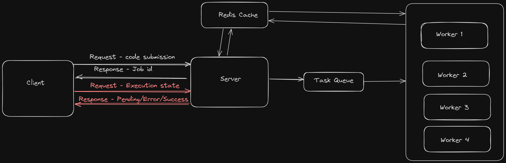

# Remote Code Execution

This API execute code in remote containerised machine securely.

- Distributed Architecure
  - High availability
  - Low latency
  - Asynchronous communication



- Resilient to mallicious program
  - Handle infinite loop
  - Handle recursive without exit condition
  - Fork Bomb
  - Manage CPU and memory heavy job

## Behind the scene - request Flow

- Client sends a POST request with:
  - Source code
  - Programming language choice
  - Input (if required)
  - Time limit
- Server responds with a unique job ID.
- Server places the request in a task queue.
- Worker node processes the request in a secure environment.
- Worker node updates status in a cache (with expiry) after execution.
- Worker node sends acknowledgment to task queue:
  - Positive acknowledgment: Task is deleted.
  - Negative acknowledgment: Task remains.
- Client uses a GET request with the job ID to:
  - Retrieve results
  - Check status (queued, running)

## How to use

After cloning run the following cmd.

```sh
docker compose up -d
```

This would spin up followig services:

1. Server - Basically publisher
2. RabbitMQ - Task Queue
3. Workers - Executers
4. RedisDB - Cache/store the result

Server would be up and listening on port 4000.

**TODOS**

- Error Handling - [in server]
- Handle File-system-tampering code - [in worker]
- Handle process alterating code - [in worker]
